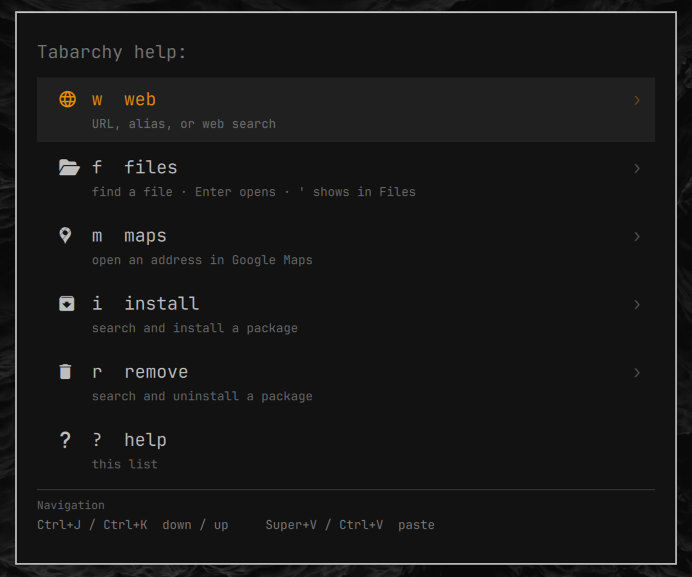

# Tabarchy



Single-letter Tab commands on Omarchy's Super+Space menu.

Normal typing still fuzzy-searches apps and the Omarchy command tree. Tab is a
toggle: one letter plus Tab switches into a command, and Tab again returns to
that letter in ordinary search.

```
Super+Space
w Tab
gh
Enter
```

opens GitHub in your default browser (`amazon` and `discord` are aliases too;
anything that looks like a URL opens as one, otherwise it searches the web).

```
Super+Space
f Tab
readme
Enter
```

opens a matching file under your home directory (`'` shows it in Files instead).

```
Super+Space
m Tab
1600 Pennsylvania Ave
Enter
```

opens Google Maps.

```
Super+Space
i Tab
ripgrep
Enter
```

searches Arch, Omarchy, and the AUR, then installs the selected package.

```
Super+Space
r Tab
ripgrep
Enter
```

searches installed packages and uninstalls the selected one.

```
Super+Space
? Tab
```

lists every command. Enter on a row jumps into it.

Plugins run unsandboxed inside the long-lived `omarchy-shell` process, with
your user permissions. Review the source before you enable it.

## Install

```bash
omarchy plugin add https://github.com/jexmarc/tabarchy.git --enable
```

From a local checkout:

```bash
omarchy plugin add /path/to/tabarchy --enable
```

Enabling Tabarchy stands in for the stock Omarchy menu so Super+Space, the bar
icon, and `omarchy menu` keep working. This is reversible. Omarchy still has
the original menu; Tabarchy just sits in front of it. See [Restore the stock
menu](#restore-the-stock-menu) if you want it back.

If you previously installed the un-namespaced `tabarchy` id, remove that first:

```bash
omarchy plugin remove tabarchy --yes
```

The menu stays loaded in `omarchy-shell`. After enabling or updating Tabarchy,
run `omarchy restart shell` so Super+Space picks up the new code.

## Restore the stock menu

Tabarchy does not delete or overwrite Omarchy's menu. The first-party
`omarchy.menu` plugin stays on the machine the whole time. While Tabarchy is
enabled, Omarchy routes Super+Space, the bar icon, and `omarchy menu` to
Tabarchy. When Tabarchy is off, those same bindings go back to the original
menu.

You can check at any time:

```bash
omarchy plugin list
```

With Tabarchy on you should see Tabarchy **enabled** and `omarchy.menu`
**disabled**. That disabled line is the stock menu, waiting to be restored.

### Turn Tabarchy off, keep the files

```bash
omarchy plugin disable io.github.jexmarc.tabarchy
```

Omarchy re-enables `omarchy.menu`. Super+Space is the stock menu again. The
Tabarchy checkout stays under `~/.config/omarchy/plugins/` so you can turn it
back on later:

```bash
omarchy plugin enable io.github.jexmarc.tabarchy
```

### Uninstall Tabarchy

```bash
omarchy plugin remove io.github.jexmarc.tabarchy
```

The CLI disables Tabarchy first, prints `Restored omarchy.menu.`, then deletes
the plugin checkout. Super+Space, the bar icon, and `omarchy menu` are the
stock Omarchy menu again. No Omarchy restart is required.

That also removes the `~/.local/bin/omarchy-tabarchy-search` symlink Tabarchy
created.

### What is left on disk

These are your files. Tabarchy does not create them unless you did, and
removal does not delete them:

```
~/.config/omarchy/tabarchy.jsonc      # optional bang overrides
~/.config/omarchy/defaults/search     # search provider, if you set one
```

They have no effect while Tabarchy is gone. Delete them by hand if you want a
clean slate.

## Commands

All of these start from Super+Space, then **one letter + Tab**.

| Type | Tab | Then |
|---|---|---|
| `w` | web | a URL, an alias, **or** a search, Enter |
| `f` | files | a filename; Enter opens, `'` shows in Files |
| `m` | maps | an address, Enter |
| `i` | install | a package name (2+ chars); pick a result, Enter to install |
| `r` | remove | an installed package (2+ chars); pick a result, Enter to uninstall |
| `?` | help | the command list plus keys; Enter opens the highlighted command |

Two or more characters never trigger a command, so `ma` still searches the menu.

`? Tab` lists every enabled command (including letters you add). Enter on a
row jumps into that command. Navigation keys sit in a footer under the list,
not as selectable rows.

### Maps (`m Tab`)

Type an address and Enter. Opens Google Maps in the default browser.

### Web (`w Tab`)

The list filters as you type:

1. Matching **aliases**
2. **Open URL** when the query looks like a URL (`amazon.com`, `https://…`)
3. **Search** with the configured provider (Google by default)

Default aliases: `amazon` → amazon.com, `discord` → discord.com, `gh` →
github.com. Add or disable aliases in `~/.config/omarchy/tabarchy.jsonc`
(watched live):

```jsonc
{
  "aliases": {
    "amazon": "https://amazon.com/",
    "discord": "https://discord.com/",
    "gh": "https://github.com/"
  }
}
```

Set an alias to `false` to drop a default. `https://` is added if you omit it.
Tabarchy does not read browser bookmarks.

The search provider is `~/.config/omarchy/defaults/search`. Enabling the plugin
puts `omarchy-tabarchy-search` on your PATH (`~/.local/bin`). That symlink is
removed when you disable or uninstall Tabarchy.

```
omarchy-tabarchy-search                 # print current provider
omarchy-tabarchy-search google
omarchy-tabarchy-search ddg
omarchy-tabarchy-search brave
omarchy-tabarchy-search --list
omarchy-tabarchy-search 'https://example.com/search?q=%s'
```

### Files (`f Tab`)

`fd` under `$HOME`. The menu is double-wide so longer paths stay readable.

- **Enter** opens the file. GUI types (images, PDFs, folders) use `xdg-open`.
  Text that would otherwise launch nvim with no terminal goes through
  `omarchy launch editor`.
- **Markdown** asks View or Edit (View is the default). **Enter** or **V**
  opens Omawrite, or the Omarchy editor if Omawrite is missing. **E** edits.
  Escape cancels.
- **`'`** (next to Enter) or **Ctrl+Enter** shows the selected file in Files
  (Nautilus selects it in the parent folder). A selected directory opens that
  folder.

### Install (`i Tab`)

Searches Arch, the Omarchy repo, then the AUR. Official matches first.
Already-installed packages stay in the list with an accent-colored Installed
badge and are skipped when moving. The menu is double-wide; every result is
the same row height, with the highlighted description in a pane under the
list. Enter opens a terminal to install (`omarchy pkg add` or
`omarchy pkg aur add`). It does not install whatever you typed.

### Remove (`r Tab`)

Same list UX as install, but only installed packages (including AUR builds
already on the machine). Enter runs `omarchy pkg drop` (`sudo pacman -Rns`).

## Keys

These are handled only while the Super+Space overlay has focus. They are not
global Hyprland binds.

| Key | Action |
|---|---|
| Tab | enter a matching one-letter command, or leave it |
| Escape | clear the query, then leave the command, then close the menu |
| Backspace / Left on an empty query | leave the command (or go back a menu) |
| Enter / Right | activate the highlighted row |
| Up / Down | move the selection |
| **Ctrl+J / Ctrl+K** | Down / Up |
| Page Up / Page Down | jump six rows |
| Super+V / Ctrl+V / Shift+Insert | paste clipboard into the current query |
| `'` or Ctrl+Enter | in `f Tab`, show the selected file in Files |
| V / E | in the markdown prompt, View / Edit |

`? Tab` shows those navigation keys in a footer under the command list.

## Configure

User config, watched live, optional. Without this file the built-in defaults
still apply:

```
~/.config/omarchy/tabarchy.jsonc
```

A starter file ships in this repo as `tabarchy.jsonc`. Copy it only if you want
to change commands. Tabarchy does not write that file for you. Set a letter to
`false` to disable a default, or add another letter:

```jsonc
{
  "g": {
    "name": "google",
    "icon": "󰊭",
    "placeholder": "search",
    "action": "omarchy-launch-browser \"https://www.google.com/search?q={{query_encoded}}\""
  },
  "i": false
}
```

Placeholders in `action`:

| Token | Meaning |
|---|---|
| `{{query}}` | the rest of the line, shell-quoted |
| `{{query_encoded}}` | URL-encoded |
| `{{url}}` | `https://` prepended if there is no scheme, quoted |

`"kind": "files"` lists `fd` matches under `$HOME`.
`"kind": "help"` lists every enabled command (`? Tab`).
`"kind": "web"` lists aliases, opens a URL, or searches.
`"kind": "packages"` searches and installs (`omarchy pkg add` / `omarchy pkg aur add`).
`"kind": "remove-packages"` searches installed packages and removes them
(`omarchy pkg drop`).

A custom `"action"` is a shell command. That is intentional and runs with your
user permissions.

## Security

Tabarchy is a shell plugin. It is not sandboxed. Treat
`~/.config/omarchy/tabarchy.jsonc` like a script: only put actions in it that
you would run yourself.

Searches (`fd`, `pacman`, `yay`) and file opens pass arguments as argv, not
through a shell. Package install/remove names are shell-quoted before they go
to `omarchy-pkg-*`. File open requires an absolute path.

## Dependencies

Already present on a normal Omarchy install:

- `fd` — file search (`f Tab`)
- `wl-paste` — clipboard paste
- `omarchy-launch-browser` — URLs, maps, and web search
- `xdg-open` / `uwsm-app` — GUI file handlers
- `nautilus` — show in Files (`'` / Ctrl+Enter)
- `omarchy-launch-editor` — text when `xdg-open` would attach no terminal
- `omawrite` — markdown View, if installed
- `python3`, `pacman`, `yay` — package search (`i Tab`, `r Tab`)
- `omarchy-pkg-add` / `omarchy-pkg-aur-add` — install (may prompt for sudo)
- `omarchy-pkg-drop` — remove (`r Tab`, may prompt for sudo)

## Why this stands in for the Omarchy menu

Omarchy's Super+Space menu is `omarchy.menu`. It has no prefix/Tab API, so a
third-party plugin cannot intercept one letter plus Tab without standing in for
that menu. Tabarchy therefore sets `clonedFrom: omarchy.menu`: Super+Space,
`omarchy menu`, and the bar icon keep working. The stock menu is not removed;
see [Restore the stock menu](#restore-the-stock-menu).

That is a stand-in, not a second launcher. Tabarchy-specific code is
`Bangs.js`, `Cli.qml`, `Scanner.qml`, `ChoiceDialog.qml`,
`bin/omarchy-tabarchy-search`, `bin/tabarchy-pkg-search`, `bin/tabarchy-open`,
and `patches/menu.patch`. `MenuModel.js` and `BarWidget.qml` are unmodified
copies of Omarchy's. `Menu.qml` is Omarchy's menu plus that patch.

`omarchy plugin update io.github.jexmarc.tabarchy` fast-forwards **this** git
repo. It does not pull Omarchy menu fixes. After an update run
`omarchy restart shell`. After an Omarchy update, rebase the stand-in onto the
new menu:

```bash
~/.config/omarchy/plugins/io.github.jexmarc.tabarchy/scripts/refresh-from-omarchy.sh
omarchy restart shell
```

If the patch no longer applies, the script leaves `Menu.qml` unchanged and
exits non-zero. The plugin keeps working with the last patched menu until the
patch is updated for that Omarchy version.

## License

MIT. See `LICENSE` and `NOTICE`. Menu files derived from Omarchy's
`omarchy.menu` (David Heinemeier Hansson). Tabarchy additions © 2026 jexmarc.
